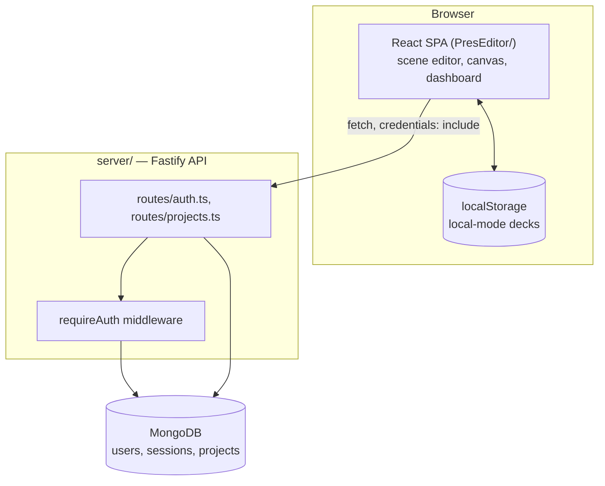
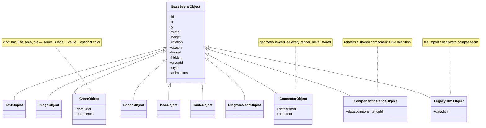
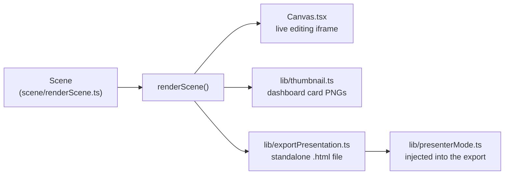
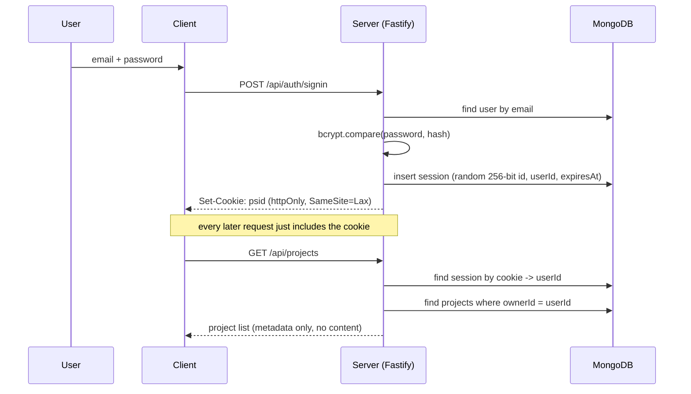
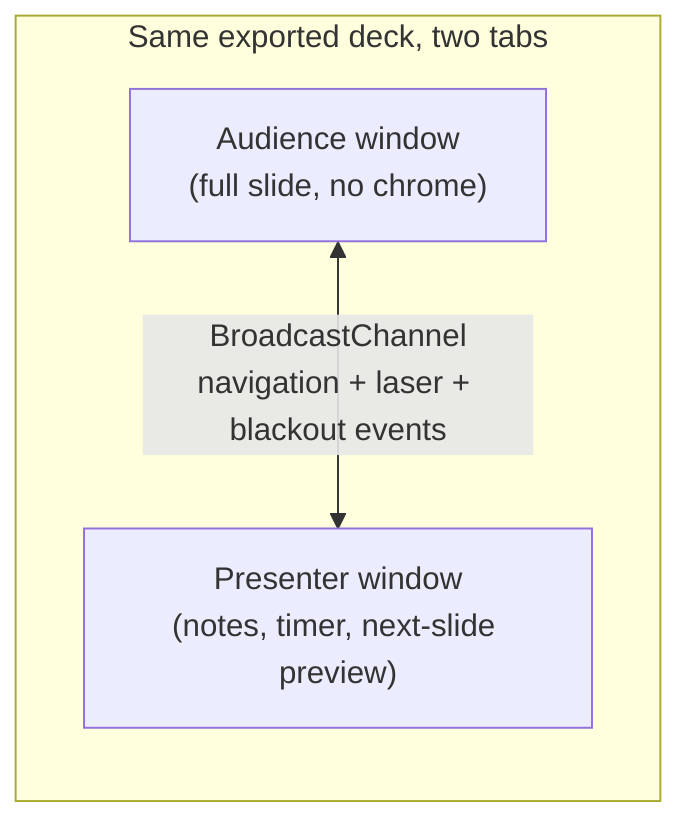

# presEditor

A browser-based, scene-graph presentation editor. Instead of editing a slide as one block of markup, every title, paragraph, image, shape, chart, or diagram node on a slide is an independent object you can select, drag, resize, rotate, and style on its own — closer to a design tool like Figma than a traditional slide editor. Decks export as a single, dependency-free HTML file that runs anywhere with no runtime and no server.

A companion API (`server/`) adds optional account-based cloud save, so a deck can live in the browser only (local mode) or be persisted to MongoDB behind email/password auth.

> For internal design decisions and trade-offs beyond this overview — the canvas rebuild strategy, undo/redo coalescing, the session model — see [ARCHITECTURE.md](./ARCHITECTURE.md).

## Contents

- [Features](#features)
- [Architecture](#architecture)
- [The scene/object model](#the-sceneobject-model)
- [Rendering pipeline](#rendering-pipeline)
- [Authentication & data flow](#authentication--data-flow)
- [Presenter mode](#presenter-mode)
- [Tech stack](#tech-stack)
- [Project structure](#project-structure)
- [Getting started](#getting-started)
- [Available scripts](#available-scripts)
- [Deployment](#deployment)
- [Project status](#project-status)

## Features

**Editing**
- Object-based canvas: select, multi-select, drag, resize, rotate, group/ungroup, align, and distribute any object on a slide
- Text, shape, icon, image, chart (bar/line/area/pie/donut), table, and diagram-node objects, each with its own style controls
- A "detach into objects" action that turns an imported slide's monolithic HTML block into individually editable native objects
- Zoom & pan canvas (`Ctrl/Cmd +/-/0/1`, `Ctrl/Cmd`+scroll, space-drag to pan) that never loses text-editing focus mid-edit
- Full undo/redo history with edit coalescing (a burst of typing collapses into one undo step)
- Keyboard shortcuts for nearly every action, with an in-app reference modal

**Deck structure**
- Sections and slides, reorderable by drag-and-drop, in both a linear sidebar and a node-graph "Vue d'ensemble" overview editor
- Master slides (shared background/branding across a section or the whole deck) and reusable components (edit once, update every instance)
- A visual diagram/flowchart builder: connect objects with routed connectors, or drop in prebuilt diagram templates
- Slide backgrounds resolved through a slide → section → deck cascade, with color/gradient/image options

**Presenting & exporting**
- Export to one self-contained HTML file — no external JS/CSS, no build step, no server required to view it
- A dedicated two-window presenter mode (audience view + presenter view with speaker notes, timer, clock, and a live "next slide" preview), kept in sync across the two windows via `BroadcastChannel`
- Print/PDF export mode

**Cloud (optional)**
- Email/password accounts, httpOnly session cookies
- Per-user project list, autosave, duplicate, rename, delete
- Fully usable without an account — local mode keeps everything in the browser only

## Architecture

Two independently deployable pieces talk over a plain JSON REST API. The client never needs the server to be reachable — it degrades to local-only storage.



The server treats a saved project's content as an opaque JSON blob — it never parses or validates the deck's internal shape, so the client's data format can evolve without ever requiring a server-side migration.

## The scene/object model

A slide "page" is a `Scene`: an ordered list of independently positioned `SceneObject`s, not a wall of hand-authored HTML. Every object shares a common set of transform/style/animation fields and adds its own `data`.



`LegacyHtmlObject` is the backward-compatibility seam: an imported `presentation.html` file becomes one full-bleed `legacy-html` object per slide on import, so an untouched deck can round-trip to export byte-identical to the original. The "detach into objects" action explodes that single object into real, independently editable `text`/`image` objects on demand, without touching anything the user hasn't asked to change.

## Rendering pipeline

One function — `renderScene()` — turns a `Scene` into HTML. Every surface that needs to show a slide calls it, rather than each maintaining its own copy of "what a slide looks like":



`renderScene(scene, mode, ctx)` takes a `mode` of `'edit'` or `'export'` — the DOM structure is identical either way; `'edit'` mode adds the `data-object-id` instrumentation the canvas needs for selection/drag/resize, and `'export'` mode strips it and takes a byte-identical fast path for any scene that hasn't been touched since import.

## Authentication & data flow

Sessions are opaque, server-issued bearer tokens (not JWTs) stored in an httpOnly, `SameSite=Lax` cookie — the client never handles a token directly.



Every project route filters by `ownerId: req.userId` at the database query level — there's no separate authorization check to forget, because a mismatched owner simply never matches the query.

## Presenter mode

"Présenter" opens the exported deck in a new tab; "Vue présentateur" opens two: an audience-facing tab and a presenter-facing tab with notes, a timer, and a live preview of the next slide. Both tabs run the exact same exported HTML/JS — which one shows the presenter layout is decided at runtime by a flag stamped into that tab's `<head>` before it loads.



## Tech stack

| Layer | Choice |
|---|---|
| Client framework | React 19 + React Router 7 |
| Build tool | Vite 8 |
| Language | TypeScript (strict) + JavaScript, incrementally migrating |
| Client state | `useReducer` + Context — no external state library |
| Linting | oxlint |
| API framework | Fastify 5 |
| Database | MongoDB 7 (official driver, no ORM) |
| Auth | bcryptjs password hashes, random opaque session tokens |
| Containerization | Docker (`server/Dockerfile`, `docker-compose.yml` for API + Mongo) |

## Project structure

```
.
├── PresEditor/                 # React/Vite client
│   ├── public/                 # static assets + the sample deck (presentation.html)
│   └── src/
│       ├── components/         # Canvas, Inspector, Layers, Sidebar, TopBar, modals…
│       ├── scene/               # the object model + renderScene.ts (the single renderer)
│       ├── state/               # EditorContext, reducer, undo/redo history
│       ├── lib/                 # import/export, presenter mode, diagrams, canvas editing
│       ├── routes/              # sign in / sign up / dashboard / editor routes
│       └── types/               # scene + editor state type definitions
└── server/                     # Fastify + MongoDB API
    └── src/
        ├── auth/                # password hashing, session issuing/validation
        ├── routes/              # auth.ts, projects.ts
        ├── db.ts                # MongoDB collections + indexes
        └── server.ts            # Fastify app: CORS, cookies, rate limiting
```

## Getting started

**Prerequisites:** Node 22+, and either a local MongoDB instance or Docker (for the optional cloud-save backend — the editor works in local mode without either).

```bash
# 1. clone
git clone https://github.com/chedlyklaa/PresEditor.git
cd PresEditor

# 2. install both packages
npm install --prefix PresEditor
npm install --prefix server

# 3. configure the API (only needed for cloud-save mode)
cp server/.env.example server/.env
# edit server/.env — at minimum set COOKIE_SECRET to a real random value

# 4. run everything (client on :5173, API on :4000, proxied together in dev)
npm run dev
```

`npm run dev` at the repo root runs both packages concurrently. To run just the client (local-mode only, no account features): `npm run dev --prefix PresEditor`.

## Available scripts

**Client (`PresEditor/`)**

| Script | What it does |
|---|---|
| `npm run dev` | Start the Vite dev server with hot reload |
| `npm run build` | Type-check and produce a production build in `dist/` |
| `npm run lint` | Run oxlint |
| `npm run typecheck` | `tsc --noEmit` |
| `npm run preview` | Serve the production build locally |

**API (`server/`)**

| Script | What it does |
|---|---|
| `npm run dev` | Start the API with `tsx watch` (auto-restart on change) |
| `npm run build` | Compile TypeScript to `dist/` |
| `npm run start` | Run the compiled API (`node dist/index.js`) |
| `npm run typecheck` | `tsc --noEmit` |

## Deployment

`docker-compose.yml` builds and runs the API and a MongoDB instance:

```bash
docker compose up -d
```

Required environment variables (see `server/.env.example`): `MONGO_URI`, `COOKIE_SECRET`, `CORS_ORIGINS`, and `NODE_ENV=production` for a real deployment (this also controls whether the session cookie is marked `Secure`, which requires serving over HTTPS behind a reverse proxy). The client is a static build (`npm run build --prefix PresEditor`) and can be hosted anywhere that serves static files — it isn't part of the current `docker-compose.yml`.

## Project status

Actively evolving. There is currently no automated test suite — changes are verified manually against the running app. Contributions, issues, and suggestions are welcome.
